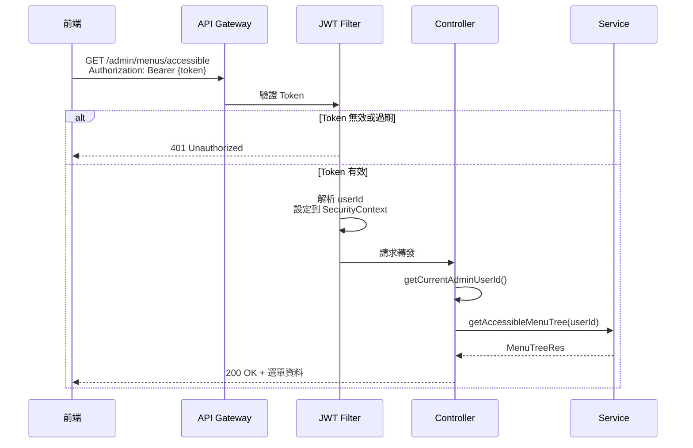

# API 安全性改進報告

## 📅 更新日期
2025-12-24

## 🎯 改進目標
將所有需要使用者身份驗證的 API 從「前端傳遞 userId」改為「後端從 JWT Token 自動解析 userId」，提升系統安全性。

---

## 🔒 安全性問題

### **原本的設計（不安全）**
```http
GET /admin/menus/accessible/{adminUserId}
Authorization: Bearer {token}
```

**問題：**
1. ❌ 前端可以傳遞任意 userId
2. ❌ 使用者可能冒充其他人的身份
3. ❌ Token 和 userId 可能不匹配
4. ❌ 需要額外驗證 Token 中的 userId 是否與路徑參數一致

### **改進後的設計（安全）**
```http
GET /admin/menus/accessible
Authorization: Bearer {token}
```

**優點：**
1. ✅ userId 從 JWT Token 自動解析，無法偽造
2. ✅ Token 驗證和身份識別一步完成
3. ✅ 防止身份冒充攻擊
4. ✅ 簡化 API 設計和前端呼叫

---

## 📝 已修改的 API

### **1. 選單管理 (MenuController)**

#### **查詢可訪問選單**
- **舊 API:** `GET /admin/menus/accessible/{adminUserId}`
- **新 API:** `GET /admin/menus/accessible`
- **變更:** 移除 `adminUserId` 路徑參數，從 JWT Token 自動取得

---

### **2. 權限檢查 (PermissionController)**

#### **檢查選單權限**
- **舊 API:** `GET /admin/permissions/check/{adminUserId}/{menuCode}`
- **新 API:** `GET /admin/permissions/check/{menuCode}`
- **變更:** 移除 `adminUserId` 路徑參數

#### **檢查查看權限**
- **舊 API:** `GET /admin/permissions/can-view/{adminUserId}/{menuCode}`
- **新 API:** `GET /admin/permissions/can-view/{menuCode}`
- **變更:** 移除 `adminUserId` 路徑參數

#### **檢查編輯權限**
- **舊 API:** `GET /admin/permissions/can-edit/{adminUserId}/{menuCode}`
- **新 API:** `GET /admin/permissions/can-edit/{menuCode}`
- **變更:** 移除 `adminUserId` 路徑參數

#### **檢查刪除權限**
- **舊 API:** `GET /admin/permissions/can-delete/{adminUserId}/{menuCode}`
- **新 API:** `GET /admin/permissions/can-delete/{menuCode}`
- **變更:** 移除 `adminUserId` 路徑參數

#### **查詢用戶角色**
- **舊 API:** `GET /admin/permissions/roles/{adminUserId}`
- **新 API:** `GET /admin/permissions/roles`
- **變更:** 移除 `adminUserId` 路徑參數

#### **檢查是否為Admin**
- **舊 API:** `GET /admin/permissions/is-admin/{adminUserId}`
- **新 API:** `GET /admin/permissions/is-admin`
- **變更:** 移除 `adminUserId` 路徑參數

#### **查詢可訪問店鋪**
- **舊 API:** `GET /admin/permissions/accessible-stores/{adminUserId}`
- **新 API:** `GET /admin/permissions/accessible-stores`
- **變更:** 移除 `adminUserId` 路徑參數

---

## 🛠️ 技術實作

### **SecurityUtils 工具類**

使用現有的 `SecurityUtils.getCurrentAdminUserId()` 方法從 Spring Security Context 中取得當前使用者 ID：

```java
public static String getCurrentAdminUserId() {
    Authentication authentication = SecurityContextHolder.getContext().getAuthentication();
    if (authentication == null || !authentication.isAuthenticated()) {
        return null;
    }
    // 從 JWT Token 解析出的 userId
    return (String) authentication.getPrincipal();
}
```

### **Controller 實作範例**

```java
@GetMapping("/accessible")
public ResponseEntity<List<MenuTreeRes>> getAccessibleMenuTree() {
    // 從 JWT Token 自動取得 userId
    String adminUserId = SecurityUtils.getCurrentAdminUserId();
    
    // 驗證是否已認證
    if (adminUserId == null) {
        return ResponseEntity.status(401).build();
    }
    
    // 執行業務邏輯
    List<MenuTreeRes> res = menuService.getAccessibleMenuTree(adminUserId);
    return ResponseEntity.ok(res);
}
```

---

## 🔐 安全性驗證流程



---

## 📊 改進效益

### **安全性提升**
- ✅ 防止身份冒充攻擊
- ✅ Token 和身份一致性保證
- ✅ 減少參數驗證邏輯
- ✅ 符合業界最佳實踐

### **程式碼簡化**
- ✅ 前端不需要管理和傳遞 userId
- ✅ 後端統一從 JWT 取得身份
- ✅ 減少 API 參數數量
- ✅ 降低前後端溝通複雜度

### **效能影響**
- 🟢 無負面影響
- 🟢 JWT 解析已在 Filter 完成
- 🟢 SecurityContext 讀取開銷極低

---

## 🧪 測試建議

### **1. 正常流程測試**
```bash
# 登入取得 Token
TOKEN=$(curl -s -X POST http://localhost:8080/admin/auth/login \
  -H "Content-Type: application/json" \
  -d '{"username":"admin@kuji.com","password":"Admin123"}' \
  | jq -r '.data.accessToken')

# 使用 Token 取得選單（不需要傳 userId）
curl -X GET http://localhost:8080/admin/menus/accessible \
  -H "Authorization: Bearer $TOKEN"
```

### **2. 未認證測試**
```bash
# 不帶 Token
curl -X GET http://localhost:8080/admin/menus/accessible
# 預期: 401 Unauthorized
```

### **3. Token 過期測試**
```bash
# 使用過期的 Token
curl -X GET http://localhost:8080/admin/menus/accessible \
  -H "Authorization: Bearer expired_token_here"
# 預期: 401 Unauthorized
```

### **4. 權限測試**
```bash
# 使用 StoreEditor 帳號登入，檢查是否只能看到有權限的選單
TOKEN=$(curl -s -X POST http://localhost:8080/admin/auth/login \
  -H "Content-Type: application/json" \
  -d '{"username":"editor@store.com","password":"Editor123"}' \
  | jq -r '.data.accessToken')

curl -X GET http://localhost:8080/admin/menus/accessible \
  -H "Authorization: Bearer $TOKEN"
```

---

## 📚 相關文件更新

### **已更新的文件**
1. ✅ `MenuController.java` - 修改 API 實作
2. ✅ `PermissionController.java` - 修改 API 實作
3. ✅ `FRONTEND_API_REFERENCE.json` - 更新 API 文檔
4. ✅ `GET_USER_MENU_GUIDE.md` - 更新使用指南
5. ✅ `API_SECURITY_IMPROVEMENTS.md` - 新增此報告

### **前端需要調整的地方**
```javascript
// ❌ 舊寫法（不要再這樣寫）
const userId = localStorage.getItem('userId');
fetch(`/admin/menus/accessible/${userId}`, {
  headers: { 'Authorization': `Bearer ${token}` }
});

// ✅ 新寫法（正確）
fetch('/admin/menus/accessible', {
  headers: { 'Authorization': `Bearer ${token}` }
});
```

---

## ⚠️ Breaking Changes

### **影響範圍**
以下 API 的 URL 已變更，前端需要同步更新：

1. `GET /admin/menus/accessible/{adminUserId}` → `GET /admin/menus/accessible`
2. `GET /admin/permissions/check/{adminUserId}/{menuCode}` → `GET /admin/permissions/check/{menuCode}`
3. `GET /admin/permissions/can-view/{adminUserId}/{menuCode}` → `GET /admin/permissions/can-view/{menuCode}`
4. `GET /admin/permissions/can-edit/{adminUserId}/{menuCode}` → `GET /admin/permissions/can-edit/{menuCode}`
5. `GET /admin/permissions/can-delete/{adminUserId}/{menuCode}` → `GET /admin/permissions/can-delete/{menuCode}`
6. `GET /admin/permissions/roles/{adminUserId}` → `GET /admin/permissions/roles`
7. `GET /admin/permissions/is-admin/{adminUserId}` → `GET /admin/permissions/is-admin`
8. `GET /admin/permissions/accessible-stores/{adminUserId}` → `GET /admin/permissions/accessible-stores`

### **遷移步驟**
1. 更新前端 API 呼叫 URL
2. 移除 userId 相關的參數處理
3. 確保 Authorization Header 正確設定
4. 測試所有受影響的功能

---

## ✅ 檢查清單

- [x] 修改 MenuController
- [x] 修改 PermissionController
- [x] 更新 API 文檔
- [x] 更新使用指南
- [x] 編譯檢查通過
- [ ] 單元測試更新
- [ ] 整合測試更新
- [ ] 前端代碼更新
- [ ] QA 測試驗證

---

## 📞 聯絡資訊

如有任何問題或建議，請聯繫開發團隊。

**文件版本:** 1.0.0  
**最後更新:** 2025-12-24  
**負責人:** KUJI System Team
