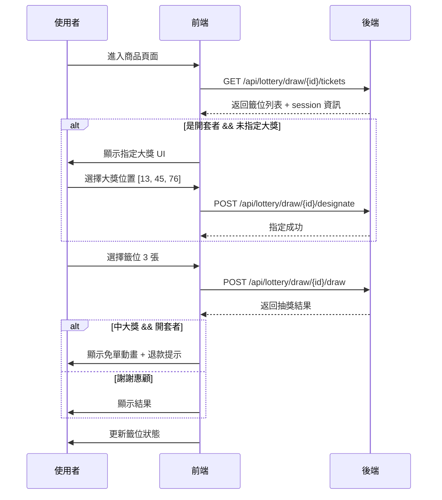
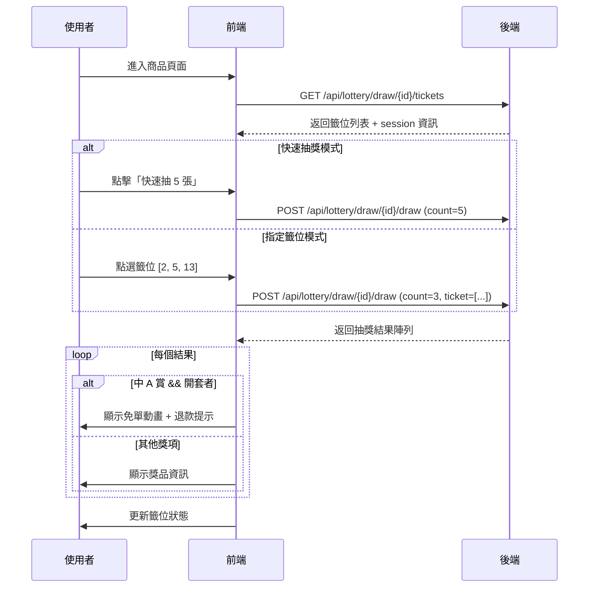
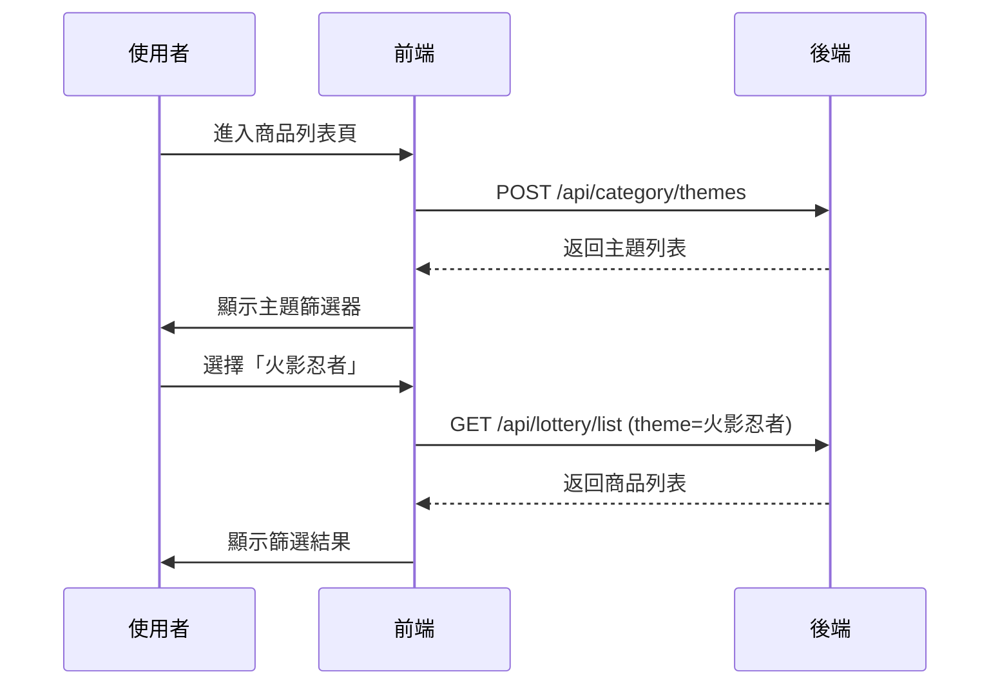

# 前端 API 完整使用指南

> **最後更新**：2026-02-11  
> **適用版本**：Admin System v1.0.0  
> **基礎路徑**：http://localhost:8080/api

---

## 📋 目錄

1. [抽獎系統 API](#1-抽獎系統-api)
   - [1.1 刮刮樂模式](#11-刮刮樂模式)
   - [1.2 扭蛋/一番賞模式](#12-扭蛋一番賞模式)
   - [1.3 通用 API](#13-通用-api)
2. [類別查詢 API](#2-類別查詢-api)
   - [2.1 查詢商品類別](#21-查詢商品類別)
   - [2.2 查詢商品主題](#22-查詢商品主題)
   - [2.3 查詢商品標籤](#23-查詢商品標籤)
   - [2.4 查詢熱門主題](#24-查詢熱門主題)
3. [完整使用流程](#3-完整使用流程)
4. [錯誤處理](#4-錯誤處理)
5. [前端實作範例](#5-前端實作範例)

---

## 1. 抽獎系統 API

> 商品公開查詢目前統一由 `LotteryController` 提供；`/api/lottery/**` 為主路徑，`/api/lottery/browse/**` 保留為相容路徑。

### 1.1 刮刮樂模式

#### 遊戲規則
- **模式識別**：`playMode` = `"SCRATCH_MODE"` 或 `"SCRATCH_CARD_MODE"`
- **大獎指定**：第一個抽獎的玩家（開套者）需要指定大獎位置
- **獎品分配**：只有指定的號碼是大獎，其他都是「謝謝惠顧」
- **開套免單**：開套玩家在保護抽數內抽中大獎，退還所有已花費金額

---

#### 1.1.1 查詢籤位列表

**請求**
```http
GET /api/lottery/draw/{lotteryId}/tickets
Authorization: Bearer <token>
```

**回應範例**
```json
{
  "success": true,
  "data": {
    "tickets": [
      {
        "ticketNumber": 1,
        "status": "AVAILABLE"
      },
      {
        "ticketNumber": 2,
        "status": "DRAWN",
        "prizeLevel": "謝謝惠顧",
        "prizeName": "謝謝惠顧",
        "drawnByNickname": "玩家A",
        "drawnAt": "2026-02-11T10:30:00"
      },
      {
        "ticketNumber": 3,
        "status": "AVAILABLE"
      }
    ],
    "session": {
      "sessionId": "uuid-xxx",
      "isOpener": true,
      "openerNickname": null,
      "protectionDraws": 5,
      "protectionEndTime": "2026-02-11T10:35:00",
      "openerDrawCount": 1,
      "freeDrawEnabled": true,
      "status": "ACTIVE"
    }
  }
}
```

**欄位說明**

| 欄位 | 類型 | 說明 |
|------|------|------|
| `ticketNumber` | int | 籤位編號（1-N） |
| `status` | string | 狀態：`AVAILABLE`（可抽）、`DRAWN`（已抽）、`LOCKED`（鎖定中） |
| `prizeLevel` | string | 獎品等級（僅 `status=DRAWN` 時才有） |
| `prizeName` | string | 獎品名稱（僅 `status=DRAWN` 時才有） |
| `drawnByNickname` | string | 抽取者暱稱（僅 `status=DRAWN` 時才有） |
| `drawnAt` | string | 抽取時間（僅 `status=DRAWN` 時才有） |

**Session 欄位說明**

| 欄位 | 類型 | 說明 |
|------|------|------|
| `sessionId` | string | 場次 ID |
| `isOpener` | boolean | 當前使用者是否為開套者 |
| `protectionDraws` | int | 保護抽數（免單機制） |
| `protectionEndTime` | string | 保護結束時間 |
| `openerDrawCount` | int | 開套者已抽次數 |
| `freeDrawEnabled` | boolean | 是否啟用免單 |
| `status` | string | 場次狀態：`ACTIVE`（進行中）、`COMPLETED`（已完成）、`EXPIRED`（已過期） |

---

#### 1.1.2 指定大獎位置（開套者專用）

**使用時機**
- 第一次進入刮刮樂商品頁面
- 當前使用者是開套者（`isOpener=true`）
- 尚未指定大獎位置

**請求**
```http
POST /api/lottery/draw/{lotteryId}/designate
Authorization: Bearer <token>
Content-Type: application/json

{
  "prizeNumbers": [13, 45, 76]
}
```

**請求欄位**

| 欄位 | 類型 | 必填 | 說明 |
|------|------|------|------|
| `prizeNumbers` | int[] | 是 | 大獎籤位編號陣列（可指定多個） |

**回應範例**
```json
{
  "success": true,
  "data": null
}
```

**前端實作範例（React）**
```typescript
// 步驟 1：查詢籤位列表
const response = await fetch(`/api/lottery/draw/${lotteryId}/tickets`, {
  headers: { 'Authorization': `Bearer ${token}` }
});
const { data } = await response.json();

// 步驟 2：檢查是否需要指定大獎
if (data.session?.isOpener) {
  const hasDesignated = data.tickets.some(t => 
    t.status === 'DRAWN' && t.prizeLevel === '大獎'
  );
  
  if (!hasDesignated) {
    // 步驟 3：顯示指定 UI
    const availableNumbers = data.tickets
      .filter(t => t.status === 'AVAILABLE')
      .map(t => t.ticketNumber);
    
    // 玩家選擇 3 個號碼：13, 45, 76
    const selectedNumbers = await showDesignationUI(availableNumbers);
    
    // 步驟 4：送出指定
    await fetch(`/api/lottery/draw/${lotteryId}/designate`, {
      method: 'POST',
      headers: {
        'Authorization': `Bearer ${token}`,
        'Content-Type': 'application/json'
      },
      body: JSON.stringify({ prizeNumbers: selectedNumbers })
    });
  }
}
```

---

#### 1.1.3 執行抽獎

**模式 1：指定籤位抽獎（推薦）**

```http
POST /api/lottery/draw/{lotteryId}/draw
Authorization: Bearer <token>
Content-Type: application/json

{
  "count": 3,
  "ticket": [
    "550e8400-e29b-41d4-a716-446655440000",
    "550e8400-e29b-41d4-a716-446655440001",
    "550e8400-e29b-41d4-a716-446655440002"
  ]
}
```

**請求欄位**

| 欄位 | 類型 | 必填 | 說明 |
|------|------|------|------|
| `count` | int | 是 | 抽獎次數（1-10） |
| `ticket` | string[] | 選填 | 票券 UUID 陣列（長度必須等於 `count`） |

**驗證規則**
- ✅ `count` 必須在 1-10 之間
- ✅ 如果提供 `ticket`，長度必須等於 `count`
- ✅ `ticket` 中不可有重複 UUID
- ✅ `ticket` 中的 UUID 必須為有效格式

**模式 2：隨機抽獎**

```http
POST /api/lottery/draw/{lotteryId}/draw
Authorization: Bearer <token>
Content-Type: application/json

{
  "count": 3
}
```

**回應範例（成功）**
```json
{
  "success": true,
  "data": [
    {
      "success": true,
      "ticketNumber": 13,
      "prizeLevel": "謝謝惠顧",
      "prizeName": "謝謝惠顧",
      "prizeImageUrl": null,
      "isGrandPrize": false,
      "triggeredFreeDraw": false,
      "refundAmount": 0,
      "message": "抽獎完成"
    },
    {
      "success": true,
      "ticketNumber": 45,
      "prizeLevel": "大獎",
      "prizeName": "PS5 主機",
      "prizeImageUrl": "https://...",
      "isGrandPrize": true,
      "triggeredFreeDraw": true,
      "refundAmount": 1000,
      "message": "恭喜中大獎！開套免單，退還 1000 元！"
    },
    {
      "success": true,
      "ticketNumber": 76,
      "prizeLevel": "謝謝惠顧",
      "prizeName": "謝謝惠顧",
      "prizeImageUrl": null,
      "isGrandPrize": false,
      "triggeredFreeDraw": false,
      "refundAmount": 0,
      "message": "抽獎完成"
    }
  ]
}
```

**回應欄位**

| 欄位 | 類型 | 說明 |
|------|------|------|
| `success` | boolean | 是否抽獎成功 |
| `ticketNumber` | int | 籤位編號 |
| `prizeLevel` | string | 獎品等級（`大獎` 或 `謝謝惠顧`） |
| `prizeName` | string | 獎品名稱 |
| `prizeImageUrl` | string | 獎品圖片 URL |
| `isGrandPrize` | boolean | 是否為大獎 |
| `triggeredFreeDraw` | boolean | 是否觸發免單 |
| `refundAmount` | long | 退款金額（觸發免單時才有） |
| `message` | string | 提示訊息 |

**前端實作範例（React）**
```typescript
// 玩家點選 3 個籤位：13, 45, 76
const selectedTickets = [
  { ticketNumber: 13, ticketId: 'uuid-13' },
  { ticketNumber: 45, ticketId: 'uuid-45' },
  { ticketNumber: 76, ticketId: 'uuid-76' }
];

// 執行抽獎
const response = await fetch(`/api/lottery/draw/${lotteryId}/draw`, {
  method: 'POST',
  headers: {
    'Authorization': `Bearer ${token}`,
    'Content-Type': 'application/json'
  },
  body: JSON.stringify({
    count: selectedTickets.length,
    ticket: selectedTickets.map(t => t.ticketId)
  })
});

const { data } = await response.json();

// 處理結果
data.forEach((result, index) => {
  if (result.success) {
    if (result.triggeredFreeDraw) {
      // 顯示免單動畫
      showFreedrawAnimation(result.refundAmount);
    }
    
    // 更新籤位狀態
    updateTicketStatus(result.ticketNumber, {
      status: 'DRAWN',
      prizeLevel: result.prizeLevel,
      prizeName: result.prizeName,
      prizeImageUrl: result.prizeImageUrl
    });
  } else {
    // 顯示錯誤訊息
    showError(result.message);
  }
});
```

---

### 1.2 扭蛋/一番賞模式

#### 遊戲規則
- **模式識別**：`playMode` = `"RANDOM_MODE"`
- **獎品分配**：商品建立時隨機分配到各籤位（A賞、B賞、C賞等）
- **抽獎方式**：玩家選號或隨機抽獎
- **開套免單**：開套玩家在保護抽數內抽中 A 賞，退還所有已花費金額

---

#### 1.2.1 查詢籤位列表

**請求**
```http
GET /api/lottery/draw/{lotteryId}/tickets
Authorization: Bearer <token>
```

**回應範例**
```json
{
  "success": true,
  "data": {
    "tickets": [
      {
        "ticketNumber": 1,
        "status": "AVAILABLE"
      },
      {
        "ticketNumber": 2,
        "status": "DRAWN",
        "prizeLevel": "C",
        "prizeName": "善逸公仔",
        "prizeImageUrl": "https://...",
        "drawnByNickname": "玩家A",
        "drawnAt": "2026-02-11T10:30:00"
      },
      {
        "ticketNumber": 3,
        "status": "DRAWN",
        "prizeLevel": "A",
        "prizeName": "炭治郎公仔（大）",
        "prizeImageUrl": "https://...",
        "drawnByNickname": "玩家B",
        "drawnAt": "2026-02-11T10:32:00"
      }
    ],
    "session": {
      "sessionId": "uuid-xxx",
      "isOpener": false,
      "protectionDraws": 5,
      "protectionEndTime": null,
      "openerDrawCount": 10,
      "freeDrawEnabled": true,
      "status": "COMPLETED"
    }
  }
}
```

**與刮刮樂的差異**
- ✅ 已抽籤位顯示完整獎品等級（A/B/C/D/E/F）
- ✅ 不需要指定大獎位置
- ✅ 獎品分配是隨機的，無法預測

---

#### 1.2.2 執行抽獎

**指定籤位抽獎**
```http
POST /api/lottery/draw/{lotteryId}/draw
Authorization: Bearer <token>
Content-Type: application/json

{
  "count": 1,
  "ticket": ["550e8400-e29b-41d4-a716-446655440000"]
}
```

**隨機抽獎（快速模式）**
```http
POST /api/lottery/draw/{lotteryId}/draw
Authorization: Bearer <token>
Content-Type: application/json

{
  "count": 5
}
```

**回應範例（抽中 A 賞 + 觸發免單）**
```json
{
  "success": true,
  "data": [
    {
      "success": true,
      "ticketNumber": 45,
      "prizeLevel": "A",
      "prizeName": "炭治郎公仔（大）",
      "prizeImageUrl": "https://...",
      "isGrandPrize": true,
      "triggeredFreeDraw": true,
      "refundAmount": 2500,
      "message": "恭喜中大獎！開套免單，退還 2500 元！"
    }
  ]
}
```

**前端實作範例（Vue）**
```typescript
// 快速抽 5 張
const quickDraw = async (count: number) => {
  const response = await fetch(`/api/lottery/draw/${lotteryId}/draw`, {
    method: 'POST',
    headers: {
      'Authorization': `Bearer ${token}`,
      'Content-Type': 'application/json'
    },
    body: JSON.stringify({ count })
  });
  
  const { data } = await response.json();
  
  // 依序顯示抽獎動畫
  for (const result of data) {
    await showDrawAnimation(result);
    
    if (result.triggeredFreeDraw) {
      await showFreedrawCelebration(result.refundAmount);
    }
  }
};
```

---

### 1.3 通用 API

#### 1.3.1 查詢場次資訊

**請求**
```http
GET /api/lottery/draw/{lotteryId}/session
Authorization: Bearer <token>
```

**回應範例**
```json
{
  "success": true,
  "data": {
    "sessionId": "uuid-xxx",
    "isOpener": true,
    "openerNickname": null,
    "protectionDraws": 5,
    "protectionEndTime": "2026-02-11T10:35:00",
    "openerDrawCount": 3,
    "freeDrawEnabled": true,
    "status": "ACTIVE"
  }
}
```

**使用場景**
- 檢查當前使用者是否為開套者
- 檢查保護期是否已結束
- 顯示開套者的抽獎進度

---

## 2. 類別查詢 API

### 2.1 查詢商品類別

**功能說明**
- 查詢所有商品類別（如：一番賞、扭蛋、刮刮樂）
- 返回每個類別的商品數量

**請求**
```http
POST /api/category/categories
Content-Type: application/json

{
  "condition": {
    "status": "ON_SHELF"
  },
  "sortBy": "product_count",
  "sortOrder": "DESC"
}
```

**請求欄位（全部選填）**

| 欄位 | 類型 | 說明 |
|------|------|------|
| `condition.category` | string | 篩選特定類別 |
| `condition.status` | string | 商品狀態：`ON_SHELF`（上架）、`OFF_SHELF`（下架） |
| `condition.keyword` | string | 關鍵字搜尋 |
| `sortBy` | string | 排序欄位：`product_count`、`hot_count`、`created_at` |
| `sortOrder` | string | 排序方式：`ASC`、`DESC` |

**回應範例**
```json
{
  "success": true,
  "data": [
    {
      "name": "OFFICIAL_ICHIBAN",
      "type": "category",
      "productCount": 120,
      "imageUrl": "https://...",
      "displayOrder": 1,
      "hotCount": 5600
    },
    {
      "name": "GASHAPON",
      "type": "category",
      "productCount": 85,
      "imageUrl": "https://...",
      "displayOrder": 2,
      "hotCount": 3200
    },
    {
      "name": "SCRATCH_CARD",
      "type": "category",
      "productCount": 32,
      "imageUrl": "https://...",
      "displayOrder": 3,
      "hotCount": 1800
    }
  ]
}
```

**前端實作範例**
```typescript
// 查詢所有類別
const fetchCategories = async () => {
  const response = await fetch('/api/category/categories', {
    method: 'POST',
    headers: { 'Content-Type': 'application/json' },
    body: JSON.stringify({
      condition: { status: 'ON_SHELF' },
      sortBy: 'product_count',
      sortOrder: 'DESC'
    })
  });
  
  const { data } = await response.json();
  
  // 渲染類別列表
  return data.map(cat => ({
    label: getCategoryLabel(cat.name), // "一番賞"、"扭蛋"、"刮刮樂"
    count: cat.productCount,
    imageUrl: cat.imageUrl
  }));
};
```

---

### 2.2 查詢商品主題

**功能說明**
- 查詢所有商品主題（如：火影忍者、進擊的巨人、排球少年）
- 返回每個主題的商品數量和熱度值

**請求**
```http
POST /api/category/themes
Content-Type: application/json

{
  "condition": {
    "status": "ON_SHELF",
    "keyword": "火影"
  },
  "sortBy": "hot_count",
  "sortOrder": "DESC"
}
```

**回應範例**
```json
{
  "success": true,
  "data": [
    {
      "name": "火影忍者",
      "type": "theme",
      "productCount": 15,
      "imageUrl": "https://...",
      "displayOrder": 0,
      "hotCount": 3200
    },
    {
      "name": "進擊的巨人",
      "type": "theme",
      "productCount": 12,
      "imageUrl": "https://...",
      "displayOrder": 0,
      "hotCount": 2800
    },
    {
      "name": "排球少年",
      "type": "theme",
      "productCount": 8,
      "imageUrl": "https://...",
      "displayOrder": 0,
      "hotCount": 1500
    }
  ]
}
```

**前端實作範例（主題篩選器）**
```typescript
// 查詢特定類別的主題
const fetchThemesByCategory = async (category: string) => {
  const response = await fetch('/api/category/themes', {
    method: 'POST',
    headers: { 'Content-Type': 'application/json' },
    body: JSON.stringify({
      condition: {
        category: category,  // "OFFICIAL_ICHIBAN"
        status: 'ON_SHELF'
      },
      sortBy: 'hot_count',
      sortOrder: 'DESC'
    })
  });
  
  const { data } = await response.json();
  
  // 渲染主題篩選器
  return data.map(theme => ({
    label: theme.name,
    value: theme.name,
    count: theme.productCount,
    image: theme.imageUrl
  }));
};
```

---

### 2.3 查詢商品標籤

**功能說明**
- 查詢所有商品標籤（如：動漫、公仔、限定、熱門）
- 返回每個標籤的商品數量

**請求**
```http
POST /api/category/tags
Content-Type: application/json

{
  "condition": {
    "category": "OFFICIAL_ICHIBAN",
    "status": "ON_SHELF"
  }
}
```

**回應範例**
```json
{
  "success": true,
  "data": [
    {
      "name": "動漫",
      "type": "tag",
      "productCount": 85,
      "imageUrl": null,
      "displayOrder": 0,
      "hotCount": 0
    },
    {
      "name": "公仔",
      "type": "tag",
      "productCount": 72,
      "imageUrl": null,
      "displayOrder": 0,
      "hotCount": 0
    },
    {
      "name": "限定",
      "type": "tag",
      "productCount": 38,
      "imageUrl": null,
      "displayOrder": 0,
      "hotCount": 0
    }
  ]
}
```

**前端實作範例（標籤雲）**
```typescript
// 查詢標籤並顯示標籤雲
const fetchTags = async () => {
  const response = await fetch('/api/category/tags', {
    method: 'POST',
    headers: { 'Content-Type': 'application/json' },
    body: JSON.stringify({
      condition: { status: 'ON_SHELF' }
    })
  });
  
  const { data } = await response.json();
  
  // 根據商品數量調整字體大小
  return data.map(tag => ({
    label: tag.name,
    count: tag.productCount,
    fontSize: calculateFontSize(tag.productCount) // 10px - 24px
  }));
};
```

---

### 2.4 查詢熱門主題

**功能說明**
- 查詢熱門主題排行榜
- 按商品數量和熱度值排序

**請求**
```http
GET /api/category/hot-themes?limit=10
```

**查詢參數**

| 欄位 | 類型 | 預設值 | 說明 |
|------|------|--------|------|
| `limit` | int | 10 | 限制返回數量 |

**回應範例**
```json
{
  "success": true,
  "data": [
    {
      "name": "火影忍者",
      "type": "theme",
      "productCount": 15,
      "imageUrl": "https://...",
      "displayOrder": 0,
      "hotCount": 3200
    },
    {
      "name": "進擊的巨人",
      "type": "theme",
      "productCount": 12,
      "imageUrl": "https://...",
      "displayOrder": 0,
      "hotCount": 2800
    }
  ]
}
```

**前端實作範例（首頁熱門主題）**
```typescript
// 取得熱門主題 Top 6
const fetchHotThemes = async () => {
  const response = await fetch('/api/category/hot-themes?limit=6');
  const { data } = await response.json();
  
  // 渲染熱門主題卡片
  return data.map(theme => ({
    title: theme.name,
    subtitle: `${theme.productCount} 件商品`,
    image: theme.imageUrl,
    hotCount: theme.hotCount
  }));
};
```

---

## 3. 完整使用流程

### 3.1 刮刮樂遊戲流程



---

### 3.2 扭蛋/一番賞遊戲流程



---

### 3.3 主題篩選流程



---

## 4. 錯誤處理

### 4.1 常見錯誤碼

| HTTP 狀態碼 | 說明 | 處理方式 |
|------------|------|---------|
| 200 | 成功 | 正常處理 |
| 400 | 請求參數錯誤 | 檢查 `count`、`ticket` 是否正確 |
| 401 | 未登入 | 跳轉登入頁 |
| 403 | 權限不足 | 顯示錯誤訊息 |
| 500 | 伺服器錯誤 | 提示稍後再試 |

---

### 4.2 業務錯誤

**錯誤 1：ticket 列表長度不符**
```json
{
  "success": false,
  "message": "ticket 列表的長度必須等於 count"
}
```
**解決方式**：確保 `ticket.length === count`

---

**錯誤 2：包含重複 UUID**
```json
{
  "success": false,
  "message": "ticket 列表不可包含重複項目"
}
```
**解決方式**：檢查前端選擇邏輯，避免重複選取

---

**錯誤 3：UUID 格式錯誤**
```json
{
  "success": false,
  "message": "ticket 列表必須包含有效的 UUID 格式"
}
```
**解決方式**：確認從 `/tickets` API 取得的 UUID 是否正確

---

**錯誤 4：餘額不足**
```json
{
  "success": false,
  "data": [{
    "success": false,
    "message": "餘額不足"
  }]
}
```
**解決方式**：提示使用者儲值

---

**錯誤 5：商品已被其他玩家鎖定**
```json
{
  "success": false,
  "data": [{
    "success": false,
    "message": "商品正在被其他玩家抽獎中，請稍後再試"
  }]
}
```
**解決方式**：顯示保護時間倒數，等待結束後重試

---

## 5. 前端實作範例

### 5.1 React + TypeScript 完整範例

```typescript
import React, { useState, useEffect } from 'react';

interface Ticket {
  ticketNumber: number;
  status: 'AVAILABLE' | 'DRAWN' | 'LOCKED';
  prizeLevel?: string;
  prizeName?: string;
  prizeImageUrl?: string;
}

interface Session {
  isOpener: boolean;
  protectionDraws: number;
  protectionEndTime: string | null;
  status: string;
}

const ScratchCardGame: React.FC<{ lotteryId: string }> = ({ lotteryId }) => {
  const [tickets, setTickets] = useState<Ticket[]>([]);
  const [session, setSession] = useState<Session | null>(null);
  const [selectedTickets, setSelectedTickets] = useState<string[]>([]);
  const [needsDesignation, setNeedsDesignation] = useState(false);

  // 步驟 1：初始化
  useEffect(() => {
    fetchTickets();
  }, [lotteryId]);

  const fetchTickets = async () => {
    const token = localStorage.getItem('token');
    const response = await fetch(`/api/lottery/draw/${lotteryId}/tickets`, {
      headers: { 'Authorization': `Bearer ${token}` }
    });
    const { data } = await response.json();
    
    setTickets(data.tickets);
    setSession(data.session);
    
    // 檢查是否需要指定大獎
    if (data.session?.isOpener) {
      const hasDesignated = data.tickets.some(
        t => t.status === 'DRAWN' && t.prizeLevel === '大獎'
      );
      setNeedsDesignation(!hasDesignated);
    }
  };

  // 步驟 2：指定大獎
  const designatePrizes = async (numbers: number[]) => {
    const token = localStorage.getItem('token');
    await fetch(`/api/lottery/draw/${lotteryId}/designate`, {
      method: 'POST',
      headers: {
        'Authorization': `Bearer ${token}`,
        'Content-Type': 'application/json'
      },
      body: JSON.stringify({ prizeNumbers: numbers })
    });
    
    setNeedsDesignation(false);
    await fetchTickets();
  };

  // 步驟 3：執行抽獎
  const draw = async () => {
    if (selectedTickets.length === 0) {
      alert('請選擇至少一張籤位');
      return;
    }

    const token = localStorage.getItem('token');
    const response = await fetch(`/api/lottery/draw/${lotteryId}/draw`, {
      method: 'POST',
      headers: {
        'Authorization': `Bearer ${token}`,
        'Content-Type': 'application/json'
      },
      body: JSON.stringify({
        count: selectedTickets.length,
        ticket: selectedTickets
      })
    });

    const { data } = await response.json();
    
    // 步驟 4：顯示結果
    for (const result of data) {
      if (result.triggeredFreeDraw) {
        alert(`恭喜中大獎！開套免單，退還 ${result.refundAmount} 元！`);
      } else {
        alert(`抽到 ${result.prizeName}！`);
      }
    }

    // 步驟 5：更新狀態
    setSelectedTickets([]);
    await fetchTickets();
  };

  // UI 渲染
  if (needsDesignation) {
    return (
      <DesignationUI 
        tickets={tickets.filter(t => t.status === 'AVAILABLE')}
        onSubmit={designatePrizes}
      />
    );
  }

  return (
    <div>
      <h2>刮刮樂遊戲</h2>
      
      {session?.isOpener && (
        <div className="opener-badge">
          您是開套者，保護抽數：{session.protectionDraws}
        </div>
      )}

      <div className="ticket-grid">
        {tickets.map(ticket => (
          <div
            key={ticket.ticketNumber}
            className={`ticket ${ticket.status}`}
            onClick={() => {
              if (ticket.status === 'AVAILABLE') {
                // 選取/取消選取
                setSelectedTickets(prev =>
                  prev.includes(ticket.ticketNumber.toString())
                    ? prev.filter(t => t !== ticket.ticketNumber.toString())
                    : [...prev, ticket.ticketNumber.toString()]
                );
              }
            }}
          >
            <div className="ticket-number">#{ticket.ticketNumber}</div>
            {ticket.status === 'DRAWN' && (
              <div className="prize-info">
                <div className="prize-level">{ticket.prizeLevel}</div>
                <div className="prize-name">{ticket.prizeName}</div>
              </div>
            )}
          </div>
        ))}
      </div>

      <button 
        onClick={draw}
        disabled={selectedTickets.length === 0}
      >
        抽獎（已選 {selectedTickets.length} 張）
      </button>
    </div>
  );
};

export default ScratchCardGame;
```

---

### 5.2 Vue 3 + Composition API 範例

```typescript
<script setup lang="ts">
import { ref, onMounted } from 'vue';

interface Ticket {
  ticketNumber: number;
  status: string;
  prizeLevel?: string;
  prizeName?: string;
}

const props = defineProps<{ lotteryId: string }>();

const tickets = ref<Ticket[]>([]);
const selectedTickets = ref<string[]>([]);

onMounted(async () => {
  await fetchTickets();
});

const fetchTickets = async () => {
  const token = localStorage.getItem('token');
  const response = await fetch(`/api/lottery/draw/${props.lotteryId}/tickets`, {
    headers: { 'Authorization': `Bearer ${token}` }
  });
  const { data } = await response.json();
  tickets.value = data.tickets;
};

const quickDraw = async (count: number) => {
  const token = localStorage.getItem('token');
  const response = await fetch(`/api/lottery/draw/${props.lotteryId}/draw`, {
    method: 'POST',
    headers: {
      'Authorization': `Bearer ${token}`,
      'Content-Type': 'application/json'
    },
    body: JSON.stringify({ count })
  });
  
  const { data } = await response.json();
  
  for (const result of data) {
    alert(`抽到 ${result.prizeName}！`);
  }
  
  await fetchTickets();
};
</script>

<template>
  <div class="lottery-page">
    <div class="quick-actions">
      <button @click="quickDraw(1)">快速抽 1 張</button>
      <button @click="quickDraw(5)">快速抽 5 張</button>
      <button @click="quickDraw(10)">快速抽 10 張</button>
    </div>

    <div class="ticket-grid">
      <div
        v-for="ticket in tickets"
        :key="ticket.ticketNumber"
        :class="['ticket', ticket.status]"
      >
        <div class="number">#{{ ticket.ticketNumber }}</div>
        <div v-if="ticket.status === 'DRAWN'" class="prize">
          {{ ticket.prizeLevel }} - {{ ticket.prizeName }}
        </div>
      </div>
    </div>
  </div>
</template>
```

---

### 5.3 主題篩選器範例

```typescript
import React, { useState, useEffect } from 'react';

const ThemeFilter: React.FC = () => {
  const [themes, setThemes] = useState([]);
  const [selectedTheme, setSelectedTheme] = useState<string | null>(null);

  useEffect(() => {
    fetchThemes();
  }, []);

  const fetchThemes = async () => {
    const response = await fetch('/api/category/themes', {
      method: 'POST',
      headers: { 'Content-Type': 'application/json' },
      body: JSON.stringify({
        condition: { status: 'ON_SHELF' },
        sortBy: 'hot_count',
        sortOrder: 'DESC'
      })
    });
    const { data } = await response.json();
    setThemes(data);
  };

  return (
    <div className="theme-filter">
      <h3>選擇主題</h3>
      <div className="theme-list">
        {themes.map((theme) => (
          <button
            key={theme.name}
            className={selectedTheme === theme.name ? 'active' : ''}
            onClick={() => setSelectedTheme(theme.name)}
          >
            {theme.name}
            <span className="count">({theme.productCount})</span>
          </button>
        ))}
      </div>
    </div>
  );
};

export default ThemeFilter;
```

---

## 6. 常見問題 (FAQ)

### Q1：為什麼未抽籤位不顯示獎品資訊？
**A**：這是安全設計，防止玩家透過開發者工具查看未抽籤位的獎品分配，確保遊戲公平性。

### Q2：快速抽獎和指定籤位抽獎有什麼差別？
**A**：
- **快速抽獎**：系統隨機選擇可用籤位，適合不在意號碼的玩家
- **指定籤位**：玩家自己選擇號碼，適合有幸運數字偏好的玩家

### Q3：什麼是開套免單？
**A**：開套玩家（第一個抽獎的玩家）在保護抽數內抽中大獎，系統會退還已花費的所有金額。例如：
- 保護抽數：5 抽
- 每抽 500 元
- 第 3 抽中大獎 → 退還 1500 元（3 × 500）

### Q4：為什麼我不能抽獎？
**A**：可能原因：
1. 餘額不足
2. 商品被其他玩家鎖定（保護期間）
3. 刮刮樂開套者尚未指定大獎位置
4. 商品已售完或下架

### Q5：如何查詢特定主題的商品？
**A**：
```typescript
// 步驟 1：查詢主題
const response = await fetch('/api/category/themes', {
  method: 'POST',
  body: JSON.stringify({
    condition: { keyword: '火影' }
  })
});

// 步驟 2：選擇主題後，查詢商品列表
const products = await fetch('/api/lottery/list', {
  method: 'POST',
  body: JSON.stringify({
    condition: { theme: '火影忍者', status: 'ON_SHELF' }
  })
});
```

---

## 7. 附錄

### 7.1 完整 API 列表

| API | 方法 | 路徑 | 說明 |
|-----|------|------|------|
| 查詢籤位列表 | GET | `/api/lottery/draw/{id}/tickets` | 取得所有籤位狀態 |
| 執行抽獎 | POST | `/api/lottery/draw/{id}/draw` | 指定或隨機抽獎 |
| 指定大獎 | POST | `/api/lottery/draw/{id}/designate` | 刮刮樂：開套者指定大獎 |
| 查詢場次 | GET | `/api/lottery/draw/{id}/session` | 取得當前場次資訊 |
| 查詢類別 | POST | `/api/category/categories` | 查詢商品類別 |
| 查詢主題 | POST | `/api/category/themes` | 查詢商品主題 |
| 查詢標籤 | POST | `/api/category/tags` | 查詢商品標籤 |
| 熱門主題 | GET | `/api/category/hot-themes` | 查詢熱門主題排行 |

---

### 7.2 遊戲模式對照表

| 模式 | `playMode` | 大獎分配 | 開套免單 | 前端顯示 |
|------|-----------|---------|---------|---------|
| 一番賞 | `RANDOM_MODE` | 隨機 | ✅ | 顯示獎品等級（A/B/C） |
| 扭蛋 | `RANDOM_MODE` | 隨機 | ✅ | 顯示獎品等級（A/B/C） |
| 刮刮樂（店家） | `SCRATCH_MODE` | 店家指定 | ✅ | 顯示大獎/謝謝惠顧 |
| 刮刮樂（玩家） | `SCRATCH_MODE` | 玩家指定 | ✅ | 顯示大獎/謝謝惠顧 |

---

### 7.3 更新記錄

| 日期 | 版本 | 更新內容 |
|------|------|---------|
| 2026-02-11 | 1.0.0 | 初版發布：完整抽獎 + 類別查詢 API 文件 |

---

## 📞 聯絡方式

如有疑問，請聯繫後端團隊：
- Email: backend@kuji.com
- Slack: #kuji-backend-support

---

**© 2026 KUJI System. All rights reserved.**
